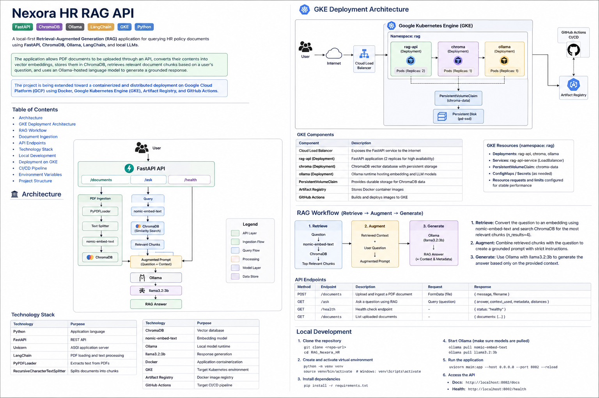

# Nexora HR RAG API

A local-first **Retrieval-Augmented Generation (RAG)** application for querying HR policy documents using **FastAPI, ChromaDB, Ollama, LangChain, and local LLMs**.

The application supports authenticated HR-policy retrieval, administrative PDF ingestion and document management, vector search through ChromaDB, and grounded answer generation through Ollama. It is designed to run locally with Docker and on **Google Cloud Platform (GCP)** using **Google Kubernetes Engine (GKE), Artifact Registry, persistent storage, and GitHub Actions**.

---

## Architecture



```text
Client
  |
  | X-API-Key / X-Admin-API-Key
  v
FastAPI
  |
  +--> /health
  +--> /ask
  +--> /retrieve
  +--> /documents
  |
  +--------------------+
  |                    |
  v                    v
ChromaDB             Ollama
  |                    |
  |                    +--> nomic-embed-text
  |                    +--> llama3.2:3b
  |
  +--> Persistent Storage
```

The RAG flow is:

```text
PDF
  |
  v
PyPDFLoader
  |
  v
RecursiveCharacterTextSplitter
  |
  v
nomic-embed-text
  |
  v
ChromaDB

Question
  |
  v
nomic-embed-text
  |
  v
ChromaDB similarity search
  |
  v
Relevant chunks
  |
  v
Grounded prompt
  |
  v
Ollama / llama3.2:3b
  |
  v
Answer
```

---

## Technology Stack

| Technology | Purpose |
|---|---|
| Python | Application language |
| FastAPI | REST API |
| Uvicorn | ASGI application server |
| LangChain | PDF loading and text processing |
| PyPDFLoader | PDF text extraction |
| RecursiveCharacterTextSplitter | Document chunking |
| ChromaDB | Vector database |
| `nomic-embed-text` | Embedding model |
| Ollama | Local model runtime |
| `llama3.2:3b` | Response generation |
| Docker | Containerization |
| GKE | Kubernetes runtime |
| Artifact Registry | Container registry |
| GitHub Actions | CI/CD |

---

## Security Model

The application uses two API-key scopes.

| Header | Purpose |
|---|---|
| `X-API-Key` | User-level RAG access |
| `X-Admin-API-Key` | Administrative document operations |

Both keys are loaded from environment variables and validated using `secrets.compare_digest()`.

Required variables:

```text
API_KEY
ADMIN_API_KEY
```

The application is configured to fail fast if either required key is missing.

### Access Model

```text
Public
└── GET /health

Authenticated user
├── GET /ask
└── GET /retrieve

Administrator
├── POST   /documents
├── GET    /documents
├── GET    /documents/list
├── DELETE /documents/{document_id}
└── DELETE /documents?confirm=DELETE_ALL_DOCUMENTS
```

Bulk deletion requires the exact confirmation phrase:

```text
DELETE_ALL_DOCUMENTS
```

---

## RAG Workflow

### 1. Retrieve

`GET /ask` embeds the incoming question and queries ChromaDB.

Current configuration:

```python
n_results=4
```

A diagnostic retrieval endpoint is also available:

```http
GET /retrieve
```

It currently uses:

```python
n_results=3
```

### 2. Augment

Retrieved chunks are combined with the user question in a grounded HR-policy prompt.

The prompt instructs the model to:

- use only retrieved context;
- avoid outside knowledge;
- avoid invented policy;
- avoid mixing unrelated leave categories;
- explicitly state when the supplied context is insufficient.

### 3. Generate

The augmented prompt is sent to Ollama using:

```text
llama3.2:3b
```

The response includes:

- generated answer;
- retrieved context;
- metadata;
- vector distances.

---

## Document Ingestion

Upload endpoint:

```http
POST /documents
```

Required header:

```text
X-Admin-API-Key: <admin-key>
```

Pipeline:

```text
PDF Upload
   |
   +--> MIME validation
   +--> 10 MB size limit
   +--> %PDF- signature validation
   |
   v
UUID-based stored filename
   |
   v
PyPDFLoader
   |
   v
RecursiveCharacterTextSplitter
   |
   v
nomic-embed-text
   |
   v
ChromaDB
```

### Upload Validation

Current protections:

```text
Maximum size: 10 MB
Required MIME type: application/pdf
Required file signature: %PDF-
```

Invalid content is rejected before it is persisted as a normal uploaded document.

### Chunking Configuration

```python
RecursiveCharacterTextSplitter(
    chunk_size=1000,
    chunk_overlap=120,
    separators=[
        "\n\n",
        "\n",
        ". ",
        " ",
        ""
    ],
)
```

Chunk IDs are derived from source, page, and a SHA-256-based content hash.

Current metadata shape:

```json
{
  "source": "./pdfs/example.pdf",
  "page": 3,
  "chunk_index": 12
}
```

---

## API Endpoints

### Health Check

```http
GET /health
```

No API key required.

Example response:

```json
{
  "status": "healthy",
  "service": "nexora-rag-api"
}
```

### Ask a Question

```http
GET /ask?question=<question>
```

Header:

```text
X-API-Key: <api-key>
```

### Retrieve Raw Context

```http
GET /retrieve?question=<question>
```

Header:

```text
X-API-Key: <api-key>
```

Returns retrieved chunks, metadata, and distances without generating an LLM answer.

### Upload a PDF

```http
POST /documents
```

Header:

```text
X-Admin-API-Key: <admin-key>
```

Content type:

```text
multipart/form-data
```

### Inspect Stored Chunks

```http
GET /documents
```

Admin only.

Returns stored chunks, metadata, and Chroma record IDs.

### List Uploaded Documents

```http
GET /documents/list
```

Admin only.

Returns unique uploaded document sources and chunk counts.

### Delete One Document

```http
DELETE /documents/{document_id}
```

Admin only.

The application resolves the matching Chroma record IDs and deletes them using:

```python
collection.delete(
    ids=document_ids_to_delete
)
```

### Delete All Documents

```http
DELETE /documents?confirm=DELETE_ALL_DOCUMENTS
```

Admin only.

The application first fetches all stored IDs, then deletes them explicitly. Empty Chroma filters such as `where={}` are not used.

---

## Project Structure

```text
RAG_Nexora_HR/
├── main.py
├── config.py
├── clients.py
├── security.py
├── requirements.txt
├── Dockerfile
│
├── routers/
│   ├── ask.py
│   ├── documents.py
│   └── healthcheck.py
│
├── tools/
│   ├── file_processor.py
│   └── logger.py
│
├── docs/
│   └── Nexora_RAG_ARCH.png
│
├── kubernetes/
│   ├── api.yaml
│   ├── chroma.yaml
│   ├── chroma-pvc.yaml
│   ├── ollama.yaml
│   └── ollama-pvc.yaml
│
└── .github/
    └── workflows/
        └── deploy.yml
```

---

## Local Installation

Clone:

```bash
git clone https://github.com/montuyajoel/RAG_Nexora_HR.git
cd RAG_Nexora_HR
```

Create a virtual environment:

```bash
python -m venv .venv
source .venv/bin/activate
```

Install dependencies:

```bash
pip install -r requirements.txt
```

---

## Ollama Setup

Pull the embedding model:

```bash
ollama pull nomic-embed-text
```

Pull the generation model:

```bash
ollama pull llama3.2:3b
```

Verify:

```bash
ollama list
```

Default local endpoint:

```text
http://localhost:11434
```

---

## ChromaDB Local Setup

Create the Docker network:

```bash
docker network create rag-network
```

Start Chroma:

```bash
docker run -d \
  --name chroma \
  --network rag-network \
  -p 8001:8000 \
  -v chroma-data:/data \
  chromadb/chroma:1.5.9
```

From the host machine:

```bash
curl http://localhost:8001/api/v2/heartbeat
```

FastAPI containers on the same Docker network should use:

```text
CHROMA_HOST=chroma
CHROMA_PORT=8000
```

The host-published `8001` port is only for direct host access.

---

## Run FastAPI with Docker

Generate development keys locally:

```bash
export API_KEY="$(openssl rand -hex 32)"
export ADMIN_API_KEY="$(openssl rand -hex 32)"
```

Build:

```bash
docker build -t nexora-rag-api .
```

Run:

```bash
docker run \
  --name nexora-rag-api \
  --network rag-network \
  -p 8000:8000 \
  -e CHROMA_HOST=chroma \
  -e CHROMA_PORT=8000 \
  -e OLLAMA_URL=http://host.docker.internal:11434 \
  -e API_KEY="$API_KEY" \
  -e ADMIN_API_KEY="$ADMIN_API_KEY" \
  nexora-rag-api
```

Health check:

```bash
curl http://localhost:8000/health
```

RAG request:

```bash
curl -G \
  -H "X-API-Key: $API_KEY" \
  "http://localhost:8000/ask" \
  --data-urlencode "question=What is the annual leave entitlement?"
```

Admin document list:

```bash
curl \
  -H "X-Admin-API-Key: $ADMIN_API_KEY" \
  "http://localhost:8000/documents/list"
```

Delete all documents:

```bash
curl -X DELETE \
  -H "X-Admin-API-Key: $ADMIN_API_KEY" \
  "http://localhost:8000/documents?confirm=DELETE_ALL_DOCUMENTS"
```

---

## Environment Variables

| Variable | Local Default | Kubernetes |
|---|---|---|
| `CHROMA_HOST` | `localhost` | `chroma` |
| `CHROMA_PORT` | `8000` | `8000` |
| `OLLAMA_URL` | `http://localhost:11434` | `http://ollama:11434` |
| `EMBEDDING_MODEL` | `nomic-embed-text` | `nomic-embed-text` |
| `LLM_MODEL` | `llama3.2:3b` | `llama3.2:3b` |
| `CHROMA_COLLECTION` | `nexora_hr` | `nexora_hr` |
| `API_KEY` | required | secret-managed |
| `ADMIN_API_KEY` | required | secret-managed |

---

## GKE Deployment

Deployment model:

```text
GitHub
   |
   v
GitHub Actions
   |
   +--> Docker build
   +--> Artifact Registry
   |
   v
Google Kubernetes Engine
   |
   +--> rag-api
   +--> chroma + PVC
   +--> ollama + PVC
```

Current configuration:

| Setting | Value |
|---|---|
| Project | `nexora-ai-agent-505409` |
| Region | `europe-west1` |
| Zone | `europe-west1-b` |
| Cluster | `rag-cluster` |
| Namespace | `rag` |
| Artifact Registry | `rag-containers` |
| API image | `nexora-rag-api` |
| FastAPI replicas | 2 |
| ChromaDB replicas | 1 |
| Ollama replicas | 1 |

Internal Kubernetes service discovery:

```text
FastAPI -> http://chroma:8000
FastAPI -> http://ollama:11434
```

Verify deployment:

```bash
kubectl get pods -n rag
kubectl get deployments -n rag
kubectl get svc -n rag
kubectl get pvc -n rag
```

---

## Logging and Error Handling

Application modules use a shared logger.

Internal exceptions are logged server-side while API clients receive sanitized error responses. This avoids exposing ChromaDB, Ollama, filesystem, or internal network details to clients.

---

## Current Engineering Status

### Implemented

- modular FastAPI router architecture;
- centralized configuration;
- shared ChromaDB and Ollama clients;
- user API-key authentication;
- separate admin API key;
- constant-time secret comparison;
- admin-only document operations;
- explicit bulk-delete confirmation;
- PDF MIME validation;
- 10 MB upload limit;
- PDF magic-signature validation;
- UUID-based uploaded filenames;
- sanitized API errors;
- server-side exception logging;
- deterministic chunk identifiers;
- ChromaDB server mode;
- Docker deployment;
- GKE deployment;
- persistent Chroma/Ollama storage;
- health endpoint for readiness/liveness checks;
- GitHub Actions CI/CD;
- Artifact Registry;
- grounded RAG prompt;
- authenticated raw retrieval endpoint.

### Recommended Next Improvements

- automated `pytest` unit, API, and integration tests;
- HTTPS ingress / managed TLS;
- rate limiting;
- JWT/OIDC authentication;
- RBAC beyond static API keys;
- tenant-scoped metadata and retrieval filters;
- Google Secret Manager integration;
- Kubernetes NetworkPolicy for ChromaDB and Ollama;
- non-root container execution;
- Kubernetes pod security context;
- asynchronous PDF ingestion;
- richer metadata such as `document_id`, version, section ID, and tenant ID;
- retrieval and generation latency metrics;
- Terraform infrastructure as code;
- pinned and regularly audited dependencies and container images.

---

## Security Notes

- Never commit `API_KEY` or `ADMIN_API_KEY`.
- Use Kubernetes Secrets or Google Secret Manager for deployed credentials.
- Do not expose ChromaDB or Ollama directly to the public internet.
- API keys should only be transmitted over HTTPS in production.
- `GET /documents` exposes raw indexed content and is therefore admin-only.
- Bulk deletion requires both admin authentication and an explicit confirmation phrase.
- Rotate development keys before using the deployment for production-like testing.

---

## License

This project is intended for educational, portfolio, and development purposes.
